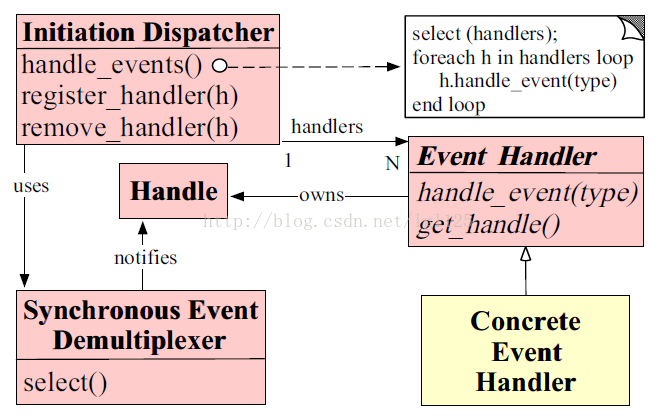
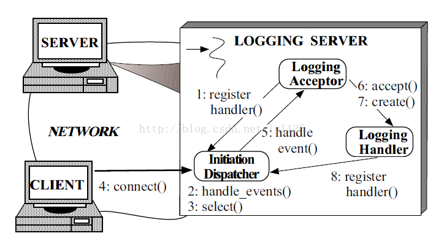
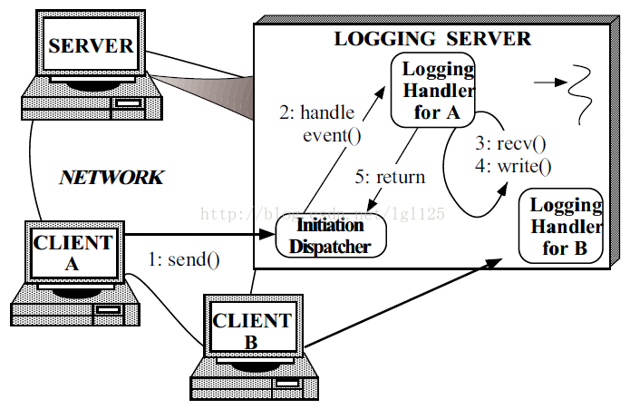

# reactor 设计模式

> 反应器(Reactor)模式是为了处理一个或多个客户端同时提交的服务请求而设计的。事件驱动的应用程序可以使用反应器结构化模式,多路分解并分配从一个或多个客户端发给应用程序的服务请求。该模式的别名有：分配器（Dispatcher），通知器（Notifier）

先用比较直观的方式来介绍一下这种方式的优点，通过和常用的多线程方式比较一下，可能更好理解。
以去饭店吃饭为例，每一伙人来就餐就是一个事件，吃饭的人会先看一下菜单，然后点菜。处理这些就餐事件的就需要我们的服务人员了。每个服务员相当于一个线程。 
多线程处理的方式会是这样的：
一个人来就餐，一个服务员去服务，然后客人会看菜单，点菜。 服务员将菜单给后厨。
二个人来就餐，二个服务员去服务……
五个人来就餐，五个服务员去服务……
 
这个就是多线程的处理方式，一个事件到来，就会有一个线程服务。很显然这种方式在人少的情况下会有很好的用户体验，每个客人都感觉自己是VIP，专人服务的。如果饭店一直这样同一时间最多来5个客人，这家饭店是可以很好的服务下去的。
 
来了一个好消息，因为这家店的服务好，吃饭的人多了起来。同一时间会来10个客人，老板很开心，但是只有5个服务员，这样就不能一对一服务了，有些客人就要没有人管了。老板就又请了5个服务员，现在好了，又能每个人都受VIP待遇了。
 
越来越多的人对这家饭店满意，客源又多了，同时来吃饭的人到了20人，老板高兴不起来了，再请服务员吧，占地方不说，还要开工钱，再请人就攒不到钱了。怎么办呢？老板想了想，10个服务员对付20个客人也是能对付过来的，服务员勤快点就好了，伺候完一个客人马上伺候另外一个，还是来得及的。综合考虑了一下，老板决定就使用10个服务人员的线程池啦~~~
 
但是这样有一个比较严重的缺点就是，如果正在接受服务员服务的客人点菜很慢，其他的客人可能就要等好长时间了。有些火爆脾气的客人可能就等不了走人了。
Reactor就可以很好的解决这个问题。
因为点菜才通常是很耗时的，所以当有人来吃饭的时候，可以先把菜单交给点菜的人自己浏览，等点菜的人想好了要点的菜的时候再招呼服务员，等服务员过来了之后就可以为顾客点菜并发送到后厨了。这个在某种意义上说就是用单线程在做多线程的事情。 
Reactor的事件驱动就体现在了只有当事件发生（客户招呼服务员点菜）的时候，服务员（线程）才去处理。而客户刚进入饭店的时候，是不需要去处理的。
从这个简单的例子应该可以基本明白Reactor是干什么的了吧。（由事件触发，并分发请求）
下面的内容主要来自：《面向模式的软件体系结构：卷2 用于并发和网络化对象的模式》的第三章的第一部分。点此下载，点此下载整本书
英文原版《Reactor  An Object Behavioral Pattern for Demultiplexing and Dispatching Handles for Synchronous Events》

以下主要针对论文中的几个图进行解释：

图1:反应器模式类图
Reactor有5个主要的成员：
Reactor（反应器）：负责响应IO事件，一旦发生，广播发送给相应的Handler去处理。反应器向具体时间处理程序分配对应的钩子方法。具体的事件调用并不需要调用反应器，而是由反应器分配一个具体的事件处理程序。具体的事件处理程序对某个指定的事件的发生做出反应。 思想可参考Ioc。
Synchronous Event Demultiplexer（同步事件分离器）：这个分离器是一个函数。可以看到类图中的select（）方法，就如java.nio.channels.Selector类中的select（）方法一样。（后面对提到） 该函数一直在阻塞，直到某个事件的发生。就如服务员一直在select（），直到有个人叫她去点菜。
Handle(描述符)：就如java.nio.channels.SelectionKey类。用来识别事件源，看这个时间是要做什么的，是请求连接，还是要读、写……
Event Handler（事件处理接口）：定义一个由一个或多个钩子方法组成的接口。
Concrete Event Handler（具体的事件处理接口）：无。




图2 ：客户机连接到登录服务器时采取的步骤

1 登录服务器首先向反应器注册接受器。
2 服务器调用事件处理方法（handle_event），这个方法是循环的。
3 调用同步事件分离器的select方法。这个方法是在handle_event中执行的。
4 客户端发来连接请求
5 handle_event方法中通知Acceptor 
6 Acceptor接收客户机的请求
7 Acceptor创建一个Handler处理客户端的请求。
8 Handler向反应器注册socket handle，即告诉分发器当这个socket什么时候“准备就绪”一定要notify我。


图3：服务器为一条登录记录服务时要采取的步骤
1 客户端发送登录记录请求
2 阻塞的select（）方法捕捉到了一个事件，并有handler_event方法传递给Handler处理。
3 登录处理程序从Socket中非阻塞的读取记录  重复2,3步，直到从socket中获取的记录被完全的接收了。
4 Handler处理记录并执行写方法。
5 Handler方法返回，循环继续执行。
以上的图片和文字来自中文的电子书。 其实书中也是从英文论文中翻译过来的。英语好的直接看原文吧。

简单的实现这个模式需要三个类来完成，本人也是参见了网上其他人的代码：http://gzcj.iteye.com/blog/307217 程序没有客户端进行测试，希望真心想学习的人自己写一个客户端测试一下。

这个是Reactor的代码，其中LoggingAcceptor作为其内部类。写到了Reactor的内部。

```java
package com.csdn;  
  
import java.io.IOException;  
import java.net.InetAddress;  
import java.net.InetSocketAddress;  
import java.nio.channels.SelectionKey;  
import java.nio.channels.Selector;  
import java.nio.channels.ServerSocketChannel;  
import java.nio.channels.SocketChannel;  
import java.util.Iterator;  
import java.util.Set;  
import java.util.logging.Logger;  
  
/** 
 * 以下代码中巧妙使用了SocketChannel的attach功能， 将Hanlder和可能会发生事件的channel链接在一起，当发生事件时， 
 * 可以立即触发相应链接的Handler。 
 */  
public class Reactor implements Runnable {  
    final Selector selector;  
    final ServerSocketChannel serverSocket;  
  
    Reactor(int port) throws IOException {  
        selector = Selector.open(); // 创建选择器  
        serverSocket = ServerSocketChannel.open(); // 打开服务器套接字通道  
        InetSocketAddress address = new InetSocketAddress(  
                InetAddress.getLocalHost(), port);  
        serverSocket.socket().bind(address);  
  
        serverSocket.configureBlocking(false); // 调整此通道的阻塞模式。 - 异步  
  
        SelectionKey sk = serverSocket.register(selector, // 向selector注册该channel  
                SelectionKey.OP_ACCEPT); // 用于套接字接受操作的操作集位。  
  
        // 利用selectionKey的attache功能绑定Acceptor,Acceptor叫做附加对象 如果有事情，触发Acceptor  
        //接收客户机的请求  
        sk.attach(new LoggingAcceptor()); // 将给定的对象附加到此键。  
    }  
  
    //这个相当于handle_event()方法  
    public void run() { // normally in a new Thread  
        try {  
            while (!Thread.interrupted()) {  
                selector.select();  
                Set selected = selector.selectedKeys();  
                Iterator it = selected.iterator();  
                // Selector如果发现channel有OP_ACCEPT或READ事件发生，下列遍历就会进行。  
                while (it.hasNext())  
                    // 来一个事件 第一次触发一个accepter线程  
                    // 以后触发SocketReadHandler  
                    dispatch((SelectionKey) (it.next()));  
                selected.clear();  
            }  
        } catch (IOException ex) {  
        }  
    }  
  
    void dispatch(SelectionKey k) {  
        Runnable r = (Runnable) (k.attachment());  
        if (r != null) {  
            //handle_event方法中通知Acceptor或者Handler   
            r.run();  
        }  
    }  
  
    class LoggingAcceptor implements Runnable { // inner  
        public void run() {  
            try {  
                SocketChannel c = serverSocket.accept();  
                if (c != null)  
                    //Acceptor创建一个Handler处理客户端的请求  
                    new LoggingHandler(selector, c); // 调用Handler来处理channel  
            } catch (IOException ex) {  
            }  
        }  
    }  
}  

```

###下面是Handler的代码，没有写成一个接口+继承的样式。

````java
package com.csdn;  
  
import java.io.IOException;  
import java.nio.ByteBuffer;  
import java.nio.channels.SelectionKey;  
import java.nio.channels.Selector;  
import java.nio.channels.SocketChannel;  
  
public class LoggingHandler implements Runnable {  
  
    // private Test test=new Test();  
  
    final SocketChannel socket;  
    final SelectionKey sk;  
  
    static final int READING = 0, SENDING = 1;  
    int state = READING;  
  
    public LoggingHandler(Selector sel, SocketChannel c) throws IOException {  
  
        socket = c;  
  
        socket.configureBlocking(false);  
        //Handler向反应器注册socket handle，即告诉分发器当这个socket什么时候“准备就绪”一定要notify我  
        sk = socket.register(sel, 0);  
  
        // 将SelectionKey绑定为本Handler 下一步有事件触发时，将调用本类的run方法。  
        // 参看dispatch(SelectionKey k)  
        sk.attach(this);  
  
        // 同时将SelectionKey标记为可读，以便读取。  
        sk.interestOps(SelectionKey.OP_READ);  
        sel.wakeup();  
    }  
  
    public void run() {  
        try {  
            // test.read(socket,input);  
            readRequest();  
        } catch (Exception ex) {  
        }  
    }  
  
    /** 
     * 处理读取data 
     *  
     * @param key 
     * @throws Exception 
     */  
    private void readRequest() throws Exception {  
  
        ByteBuffer input = ByteBuffer.allocate(1024);  
        input.clear();  
        try {  
            int bytesRead = socket.read(input);  
            // 激活线程池 处理这些request  
            // requestHandle(new Request(socket,btt));  
        } catch (Exception e) {  
        }  
    }  
}  
````


http://www.jdon.com/concurrent/reactor.htm

http://blog.csdn.net/vking_wang/article/details/14166493（强烈推荐）

http://www.jdon.com/concurrent/reactor.htm