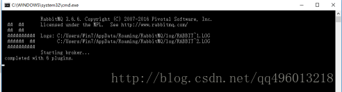

### rabbitMq 安装

#### Windows下启动RabbitMQ服务及安装详解

> 安装详解步骤如下及问题的解决：

1. 启动RabbitMQ服务需要Erlang的环境。 
如下地址同时下载和安装： 
Erlang：[Erlang](http://www.erlang.org/download.html) 
RabbitMQ ：[RabbitMQ](http://www.rabbitmq.com/download.html) 
安装RabbitMQ时注意如下图： 
这里写图片描述


RabbitMQ Service默认是自动勾选中的，这里我们取消勾选。如选中启动RabbitMQ服务时会报如下图错误： 
这里写图片描述

安装完成后，Erlang和RabbitMQ环境变量是没有配置的，需要自己手动去配置，如下图： 
这里写图片描述

这里写图片描述
 
变量名分别为：ERLANG_HOME 、RABBITMQ_SERVER；同时把变量为配置在path环境变量中即可。 
然后我们启动RabbitMQ服务，如下图： 
这里写图片描述
 
我们看上图 completed with 0 plugins. 意思是插件为0；我们服务启动了但是访问不了http://localhost:15672/就是缺少插件。也就是界面管理工具所需的插件，找到RabbitMQ的安装目录执行第一种方式，如下命令：

    
    rabbitmq-plugins enable rabbitmq_management
第二种方式，如下命令：

    rabbitmq-plugins enable plugin-name
其中的 plugin-name 包括下面的名字，下面每一个输入执行一次即可：

````
mochiweb
webmachine
rabbitmq_mochiweb
amqp_client
rabbitmq_management_agent
rabbitmq_management
````

建议使用第一种方式执行，执行完命令如下图说明已经成功的安装插件：

这里写图片描述
 

最后，我们启动RabbitMQ服务即可，如下图： 
这里写图片描述 
 

显示已有6个插件，最后我们在浏览器输入：http://localhost:15672/ 进行测试； 
这里写图片描述
 

默认的登陆账号为：guest，密码为：guest。