## redis支持的数据类型

### 一、字符串<String>

1. 字符串类型：实际上可以是字符串（包括XML JSON），还有数字（整形 浮点数），二进制（图片 音频 视频），最大不能超过512MB

2. 设值命令：

```
set name lgs ex 10  //10秒后过期  px 10000 毫秒过期

setnx name lgs  //不存在键name时才能设置，返回1设置成功；存在的话失败0

set age 29    //存在键age时直接覆盖之前的键值，返回1成功

```

> 场景：如果有多客户同时执行setnx,只有一个能设置成功，可做分布式锁

获值命令：

    get age //存在则返回value, 不存在返回nil

批量设值：

    mset country china city beijing

批量获取：
    
    mget country city address //返回china  beigjin, address为nil   

若没有mget命令，则要执行n次get命令，从而占用网络资源影响性能

使用mget＝1次网络请求+redis内部n次查询，一次性返回所有查询结果

3. 计数：


    incr age //必须为整数自加1，非整数返回错误，无age键从0自增返回1

    decr age //整数age减1，非整数返回错误，无age键从0自减返回-1

    incrby age 2 //整数age+2

    decrby age 2//整数age -2

    incrbyfloat age 1.1 //整数age+1.1

4. append追加指令：


    set name hello; append name world //追加后成helloworld

5. 字符串长度：

     
    set hello “世界”；strlen hello//结果6，每个中文占3个字节

6. 截取字符串：

    
    set name helloworld ; getrange name 2 4//返回 llo

7. 内部编码：

int:8字节长整型

　　
    
    set age 100; object encoding age //返回int

    embstr:小于等于39字节串
    
    set name bejin;

    object encodeing name //返回embstr

raw:大于39字节的字符串


    set a fsdfwerwerweffffffffffdfsaaaaaaaaaaaaaaaaaaaaaaaaaaaaaaaaaaaaaaaaaaaaaaaaaaaaaaaaaaaaaaaaaaaaaaaaaaaaaaaaaaaaaaaaaaaaaaaaaaaaaaaaaaaaa
    object encoding a //返回raw

8. 切换数据库:

    
    select 2

9. 应用场景：

键值设计：业务名:对象名:id:[属性]

数据库为order, 用户表user，对应的键可为 order:user:1 或order:user:1:name

注意：redis目前处于受保护模式，不允许非本地客户端链接，可以通过给redis设置密码，然后客户端链接的时候，写上密码就可以了

   　　127.0.0.1:6379> config set requirepass 123456  临时生效

　　　或者修改redis.conf   requirepass 123456,

　　　启动时./redis-server redis.conf指定conf

           ./redis-cli -p 6379 -a 12345678  //需要加入密码才能访问
           
### 哈希hash

> 哈希hash是一个string类型的field和value的映射表，hash适合用于存储对象。

1. 命令  


    hset key field value

   设值：
    
    hset user:1 name lgs         //成功返回1，失败返回0

   取值：
   
    hget user:1 name              //返回lgs

   删值：
   
    hdel user:1 age               //返回删除的个数

   计算键对应的字段个数：


    hset user:1 name lgs; hset user:1 age 27;

    hlen user:1               //返回2，user:1有两个属性值

   批量设值：
   
   
    hmset user:2 name ll age 28 sex boy //返回OK
   
   批量取值：
   
    hmget user:2 name age sex   //返回三行：ll 28 boy

   判断field是否存在：
   
    hexists user:2 name //若存在返回1，不存在返回0

   获取所有field:
    
    hkeys user:2            // 返回name age sex三个field

   获取user:2所有value：
   
    hvals user:2     // 返回ll 28 boy

   获取user:2所有field与value：
   
    hgetall user:2 //name age sex ll 28 boy值

   增加1：
        
    hincrby user:2 age 1      //age+1
    hincrbyfloat user:2 age 2   //浮点型加2

2. 内部编码：ziplist<压缩列表>和hashtable<哈希表>

当field个数少且没有大的value时，内部编码为ziplist

 　　如：
 
    hmset user:3 name lgs age 27; object encoding user:3 //返回ziplist

当value大于64字节，内部编码由ziplist变成hashtable

  如：
    
    hset user:4 address “a64字节”; object encoding user:3 //返回hashtable

HASH类型是稀疏，每个键可以有不同的filed, 若用redis模拟做关系复杂查询开发因难，维护成本高

3. 三种方案实现用户信息存储优缺点：

   1. 原生：
    
    
     set user:1:name james;
     set user:1:age  23;
     set user:1:sex boy;
   
  优点：简单直观，每个键对应一个值

  缺点：键数过多，占用内存多，用户信息过于分散，不用于生产环境

2. 将对象序列化存入redis
    
    
    set user:1 serialize(userInfo);

   优点：编程简单，若使用序列化合理内存使用率高

   缺点：序列化与反序列化有一定开销，更新属性时需要把userInfo全取出来进行反序列化，更新后再序列化到redis

3. 使用hash类型：

    
    hmset user:1 name james age 23 sex boy

   优点：简单直观，使用合理可减少内存空间消耗

   缺点：要控制ziplist与hashtable两种编码转换，且hashtable会消耗更多内存

总结：对于更新不多的情况下，可以使用序列化，对于VALUE值不大于64字节可以使用hash类型      

#### 应用场景

数据库有张用户表结构如下

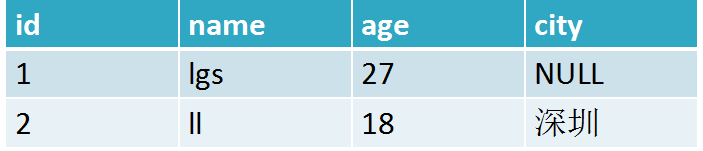

使用hash转存

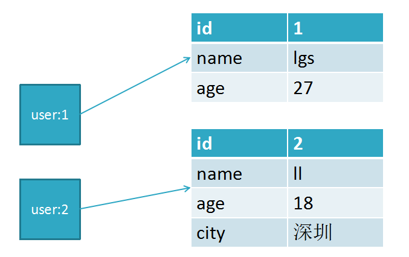

### 列表<list>

1. 用来存储多个有序的字符串，一个列表最多可存2的32次方减1个元素

因为有序，可以通过索引下标获取元素或某个范围内元素列表， 列表元素可以重复

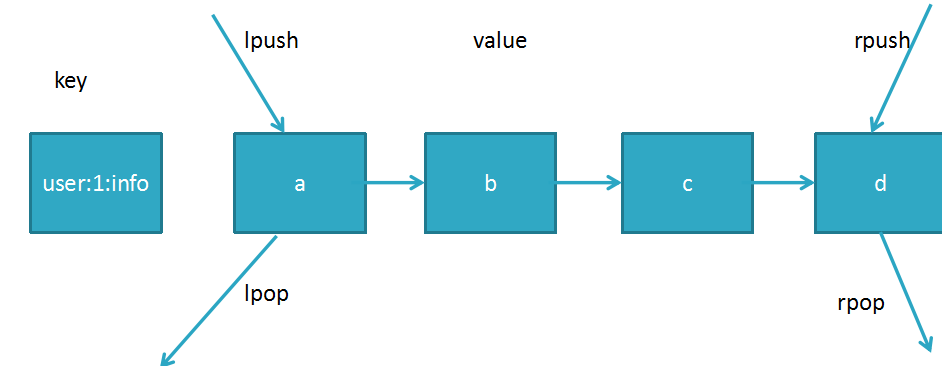

2. 列表相关命令 

添加命令：

    rpush lpush linset

    rpush name a b c d //从右向左插入a b c d, 返回值4

    lrange name  0 -1 //从左到右获取列表所有元素 返回 a b c d

    lpush fav a b c d//从左向右插入a b c d

    linsert fav before b r //在b之前插入r, after为之后，使 用lrange fav 0 -1 查看：d c r b a

查找命令：lrange lindex llen

    lrange key start end //索引下标特点：从左到右为0到N-1

    lindex fav -1 //返回最右末尾a，-2返回b

    llen fav //返回当前列表长度 5

删除命令：lpop rpop lrem ltrim

    lpop fav //把最左边的第一个元素d删除

    rpop fav //把最右边的元素a删除

    lrem key count value//删除指定元素

如：lpush test b b b b b j x z //键test放入z x j b b b b b

    Lrange test 0 -1 //查询结果为 z x j b b b b b

    lrem test 4 b  //从左右开始删除b的元素,删除4个，

若lrem test 8 b, 删除8个b, 但只有5个全部删除

    lrange test 0 -1 //删除后的结果为 b j x z

    lrem test 0 b  //检索所有b全部删除 j x z

    lpush user b b b b b j x z //键user从左到右放入 z x j b b b b b

    ltrim user 1 3  //只保留从第2到第4的元素x j b，其它全删

    lrange user 0 -1 //查询结果为 x j b, 其它已全被删掉

修改命令：lset

    lpush user01 z y x //键user01从左到右放入x y z

    lset user01 2 java // 把第3个元素z替换成java

    lrange user01 0 -1 //查询结果为 x y java

 阻塞命令：blpop brpop

3. 列表内部编码
1. 当元素个数少且没大元素，编码为ziplist,减少内存的使用
    
    
    rpush list a b c
    object encoding list //返回ziplist

2，当元素超过512个，或元素超过64字节，内部编码变成linkedlist链表;

    rpush list a1 a2 ....a513  或rpush list xxxxxxxxxxxxxx

    object encoding list  //linkedlist

在3.2版本以后，redis提供了quicklist内部编码，它结合了ziplist和linkedlist两者的优势，之前的ziplist是存在BUG的，使用quicklist内部编码效率更高，所以我们现在3.2以后看不到这两个编码，只看到quicklist, 

4. 列表应用场景
    以订单为例子（不推荐使用redis做消息队列）

1.每个用户有多个订单key为 order:1   order:2  order:3, 结合hmset

    hmset order:1 orderId 1 money 36.6 time 2018-01-01

    hmset order:2 orderId 2 money 38.6 time 2018-01-01

    hmset order:3 orderId 3 money 39.6 time 2018-01-01

   把订单信息的key放到队列

    lpush user:1:order order:1 order:2 order:3

   每新产生一个订单，

     hmset order:4 orderId 4 money 40.6 time 2018-01-01

追加一个order:4放入队列第一个位置

    lpush user:1:order order:4

 当需要查询用户订单记录时：
```redshift
 List orderKeys = lrange user:1 0 -1 //查询user:1 的所有订单key值

  for(Order order: orderKeys){

           hmget order:1

}
```
四. 无序集合set
保存多元素，与列表不一样的是不允许有重复元素，且集合是无序，一个集合最多可存2的32次方减1个元素，除了支持增删改查，还支持集合交集、并集、差集；

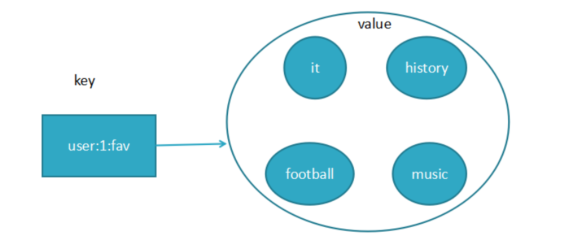
1. 无序集合set相关命令

元素操作：exists sadd smembers srem scard spop

    exists user //检查user键值是否存在
    sadd user a b c//向user插入3个元素，返回3
    sadd user a b //若再加入相同的元素，则重复无效，返回0
    smembers user //获取user的所有元素,返回结果无序
    srem user a //返回1，删除a元素
    scard user //返回2，计算元素个数

    sismember user a //判断元素是否在集合存在，存在返回1，不存在0
    srandmember user 2 //随机返回2个元素，2为元素个数
    spop user 2 //随机返回2个元素a b,并将a b从集合中删除
    smembers user //此时已没有a b, 只有c

集合交集：sinter

    sadd user:1 zhangsan 24 girl
    sadd user:2 james 24 boy//初始化两个集合
    sinter user:1 user:2 //求两集合交集， 此时返回24

    sadd user:3 wang 24 girl //新增第三个元素
    sinter user:1 user:2 user:3 //求三个集合的交集，此时返回24

集合的并集（集合合并去重）：sunion

    sunion user:1 user:2 user:3   //三集合合并(并集)，去重24
 
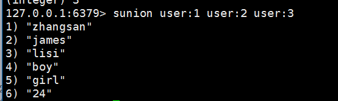
集合差集：sdiff

    diff user:1 user:2//1和2差集,(zhangsan 24 girl)-(james 24 boy)=zhangsan girl

将集合的结果另存到队列：sinterstore sunionstore sdiffstore

将交集(jj)、并集(bj)、差集(cj)的结果保存：
   
    sinterstore user_jj user:1 user:2 //将user:1 user:2的交集保存到user_jj
    sunionstore user_bj user:1 user:2 //将user:1 user:2的(并)合集保存user_bj
    sdiffstore user_cj user:1 user:2 //将user:1-user:2的差集保存user_cj
    smemebers user_cj // 返回zhangsan girl

2. 内部编码

    
    sadd user 1 2 3 4 //当元素个数少(小于512个)且都为整数，redis使用intset 减少内存的使用
    sadd user 1 2...513 //当超过512个或不为整数（比如a b）时，编码为hashtable
    object encoding user //hashtables

3.无序集合set的应用场景

标签，社交，查询有共同兴趣爱好的人，智能推荐
使用方式：
给用户添加标签：
    
    sadd user:1:fav basball fball pq
    sadd user:2:fav basball fball 
    ............

或给标签添加用户

    sadd basball:users user:1 user:3
    sadd fball:users user:1 user:2 user:3
    ........

计算出共同感兴趣的人：

    sinter user:1:fav user2:fav

五、有序集合

常用于排行榜，如视频网站需要对用户上传视频做排行榜，或点赞数

与集合有联系，不能有重复的成员

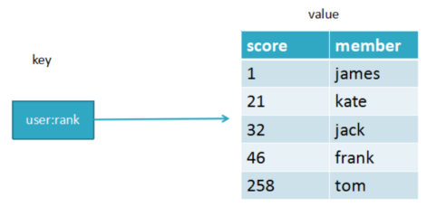

有序集合与集合set及队列list区别：

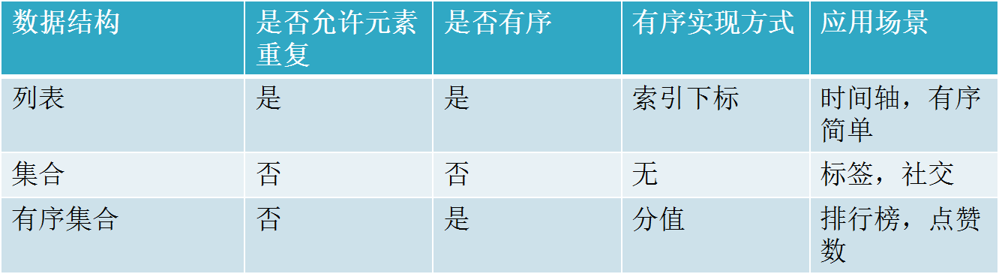

1.有序集合相关命令

添加命令

    zadd key score member [score member......]
    zadd user:zan 200 james //james的点赞数1, 返回操作成功的条数1
    zadd user:zan 200 james 120 mike 100 lee// 返回3

    zadd test:1 nx 100 james //键test:1必须不存在，主用于添加
    zadd test:1 xx incr 200 james //键test:1必须存在，主用于修改,此时为300
    zadd test:1 xx ch incr -299 james //返回操作结果1，300-299=1

查看命令

    zrange test:1 0 -1 withscores //查看点赞（分数）与成员名
    zcard test:1 //计算成员个数， 返回1

查点赞数
    
    zadd test:2 nx 100 james //新增一个集合
    zscore test:2 james //查看james的点赞数（分数），返回100

排名：

    zadd user:3 200 james 120 mike 100 lee//先插入数据
    zrange user:3 0 -1 withscores //查看分数与成员

    zrank user:3 james //返回名次：第3名返回2，从0开始到2，共3名
    zrevrank user:3 james //返回0， 反排序，点赞数越高，排名越前

删除命令

删除成员：

    zrem user:3 jame mike //返回成功删除2个成员，还剩lee

增加分数：

    zincrby user:3 10 lee //成员lee的分数加10
    zadd user:3 xx incr 10 lee //和上面效果一样

返回指定排名范围的分数与成员

    zadd user:4 200 james 120 mike 100 lee//先插入数据
    zrange user:4 0 -1 withscores //返回结果如下图

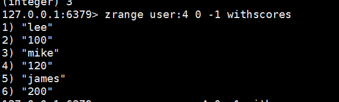

    zrevrange user:4 0 -1 withscores   //倒序，结果如下图
 
 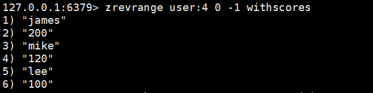
 
 返回指定分数范围的成员
 
    zrangebyscore user:4 110 300 withscores //返回结果如下图, 由低到高
 
 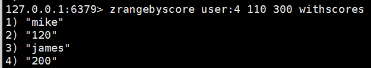
 
    zrevrangebyscore user:4 300 110 withscores //返回结果如下图,由高到低
 
  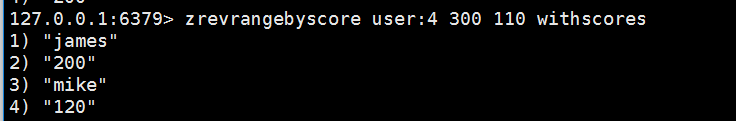

    zrangebyscore user:4 (110 +inf withscores//110到无限大，
 
 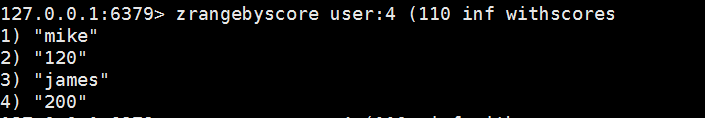
 
    zrevrangebyscore user:4 (110 -inf withscores//无限小到110
 
  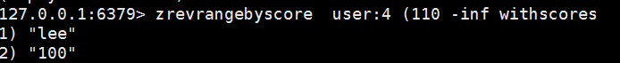
  
  返回指定分数范围的成员个数：
  
    zcount user:4 110 300 //返回2，由mike120和james200两条数据
  
   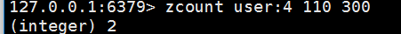
   
   删除指定排名内的升序元素：
   
    zremrangebyrank user:4 0 1 //分数升序排列，删除第0个与第1个，只剩james
   
   删除指定分数范围的成员
   
    zadd user:5 200 james 120 mike 100 lee//先插入测试数据
    zremrangebyscore user:5 210 300 //删除分数在210与300范围的成员
    zremrangebyscore user:5 (100 +inf //删除分数大于100(不包括100),还剩lee
   
   有序集合交集：
   
      格式：
      zinterstore destination numkeys key ... [WEIGHTS weight] [AGGREGATE SUM|MIN|MAX]
   
      destination:交集产生新的元素存储键名称
   
      numkeys:  要做交集计算的键个数
   
      key :元素键值
   
      weights:每个被选中的键对应值乘weight, 默认为1
   
   初始化数据：
   
          zadd user:7 1 james 2 mike 4 jack 5 kate      //初始化user:7数据
   
          zadd user:8 3 james 4 mike 4 lucy 2 lee  6 jim  //初始化user:8数据
   
   交集例子：
   
     zinterstore user_jj 2 user:7 user:8 aggregate sum //2代表键合并个数，
   
   //aggregate sum可加也不可加上，因为默认是sum
   
   //结果user_jj：4james(1+3), 6mike(2+4)
   
   zinterstore user_jjmax 2 user:7 user:8 aggregate max 或min
   
   //取交集最大的分数，返回结果 3james  4mike, min取最小
   
    weights:
   
     zinterstore user_jjweight 2 user:7 user:8 weights 8 4 aggregate max
   
     //1,取两个成员相同的交集，user:7->1 james  2 mike;  user:8->3 james  4 mike
   
     //2,将user:7->james 1*8=8,  user:7->mike 2*8 =16,最后user:7结果 8 james  16 mike;
   
    //3,将user:8-> james 3*4=12, user:8->mike 4*4=16，最后user:8结果12 james  16 mike
   
    //4,最终相乘后的结果，取最大值为  12 james 16mike
   
    //5, zrange user_jjweight 0 -1 withscores 查询结果为  12 james 16mike
   
   总结：将user:7成员值乘8，将user:8成员值乘4，取交集，取最大
   
   有序集合并集（合并去重）：
   
   格式：
       
       zunionstore destination numkeys key ... [WEIGHTS weight] [AGGREGATE SUM|MIN|MAX]
   
       destination:交集产生新的元素存储键名称
   
       numkeys:  要做交集计算的键个数
   
       key :元素键值
   
       weights:每个被选中的键对应值乘weight, 默认为1
   
    zunionstore user_jjweight2 2 user:7 user:8 weights 8 4 aggregate max
   
   //与以上zinterstore一样，只是取并集，指令一样
   
   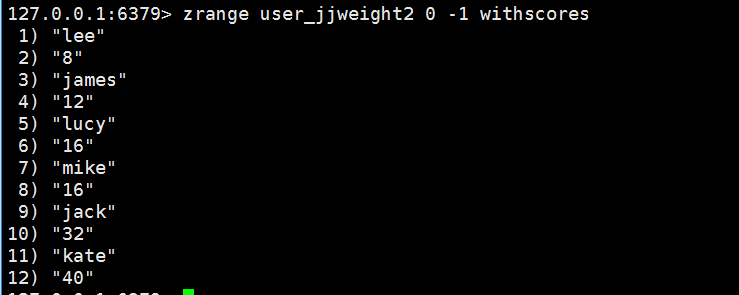
   
   2.有序集合内部编码
   1. ziplist:
   
    zadd user:9 20 james 30 mike 40 lee
    object encoding user:9 //返回ziplist
    //当元素个数少（小于128个），元素值小于64字节时，使用ziplist编码，可有效减少内存的使用
   2.skiplist:
   
    zadd user:10 20 james......
   //大于128个元素或元素值大于64字节时为skiplist编码
   
   3.使用场景：
   
   排行榜系统，如视频网站需要对用户上传的视频做排行榜
   
   点赞数：zadd user:1:20180106 3 mike  //mike获得3个赞
   
   再获一赞：zincrby user:1:20180106 1 mike  //在3的基础上加1
   
   用户作弊，将用户从排行榜删掉：zrem user:1:20180106 mike
   
   展示赞数最多的5个用户：zrevrangebyrank user:1:20180106  0  4
   
   查看用户赞数与排名：
   
       zscore user:1:20180106 mike   zrank user:1:20180106 mike
   
    
    