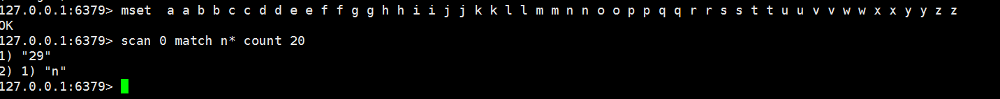

## redis键管理和redis数据库管理

一、redis键管理

1 键重命名
```
rename oldKey newkey //格式
rename oldKey newKey //若oldKey之前存在则被覆盖
set name james ；set name1 mike //数据初始化
renamenx name name1 //重命名失败，只有当name1不存在才能改名
```
2 返回随机键

    randomkey //返回随机键

3 键过期
```
expire name:03 20 //键name:03 在10秒后过期
ttl name:03 //查看过期按秒到计时，当返回-2说明已删除
pttl name:03 //查看过期按毫秒到时计
set name:05 james //初始化数据
pexpire name:05 20000 //20000毫秒（20S）后过期
expire name:06 -2 //直接过期，和del一样
```

设置键在某个时间点过期 使用的是时间戳 
    
    expireat name:04 1516971599 //设置在2018/01/27 20:59:59过期
时间转时间戳：网址http://tool.chinaz.com/Tools/unixtime.aspx
```
hset user:01 name james //初始化数据
expire user:01 60 //设置60S后过期
ttl user:01 //查看过期剩余时间
persist user:01 //去掉过期
ttl user:1 //返回-1 可以永久查询不失效
```
注意：对于字符串重设值后，expire无效，
```
set name james
expire name 50
ttl name
set name james1 //此时expire取消
ttl name //返回-1， 长期有效
```
4. 键的迁移
把部分数据迁移到另一台redis服务器
```
 move key db  //reids有16个库， 编号为0－15

 set name james1;  move name 5 //迁移到第6个库

 select 5 ;//数据库切换到第6个库， get name  可以取到james1
```
 这种模式不建议在生产环境使用，在同一个reids里可以玩

2  dump key; 


    restore key ttl value//实现不同redis实例的键迁移，ttl=0代表没有过期时间
例子：在A服务器上 192.168.1.111

    set name james;

    dump name; //  得到"\x00\x05james\b\x001\x82;f\"DhJ"

在B服务器上：192.168.1.118

    restore name 0 "\x00\x05james\b\x001\x82;f\"DhJ" 

    get name  //返回james

3,migrate指令迁移到其它实例redis，在1.111服务器上将test移到118
```
migrate

192.168.1.118

6379  

test

0

1000

copy

replace

keys
```
指令

要迁移的目标IP

端口

迁移键值

目标库

超时时间

迁移后不删除原键

不管目标库是不存在test键都迁移成功

迁移多个键

5. 键的遍历
redis提供了两个命令来遍历所有的键

1，键全量遍历：
```
mset country china city bj name james  //设置3个字符串键值对 

keys  * //返回所有的键, *匹配任意字符多个字符

keys *y //以结尾的键， 

keys n*e //以n开头以e结尾，返回name

keys n?me  //  ?问号代表只匹配一个字符  返回name,全局匹配 

keys n?m*   //返回name

keys [j,l]*  //返回以j l开头的所有键  keys [j]ames 全量匹配james
```

考虑到是单线程， 在生产环境不建议使用，如果键多可能会阻塞，如果键少，可以

2，渐进式遍历

    mset  a a b b c c d d e e f f g g h h i i j j k k l l m m n n o o p p q q r r s s t t u u v v w w x x y y z z    //初始化26个字母键值对

字符串类型： 

    scan 0 match n* count 20 //匹配以n开头的键，取20条，第一次scan 0开始



第二次从游标10开始取20个以n开头的键，相当于一页一页的取，当最后返回0时，键被取完

 

注：渐进式遍历可有效地解决keys命令可能产生的阻塞问题
除scan字符串外：还有以下
SCAN 命令用于迭代当前数据库中的数据库键。
SSCAN 命令用于迭代集合键中的元素。
HSCAN 命令用于迭代哈希键中的键值对。
ZSCAN 命令用于迭代有序集合中的元素（包括元素成员和元素分值）。
用法和scan一样

二、redis数据库管理

    select 0 //共16个库， 0 －－15， select切换数据库
    set name james
    select 1
    get name //隔离了，取不到，和mysql不同库一样

其中redis3.0以后的版本慢慢弱化了这个功能，如在redis cluster中只允许0数据库
原因：
1. redis单线程，如果用多个库，这些库使用同一个CPU,彼此会有影响
2. 多数据库，调试与运维麻烦，若有一个慢查询，会影响其它库查询速度
3. 来回切换，容易混乱

    flushdb: 只清空当前数据库的键值对 dbsiz 0
    flushall: 清空所有库的键值对 （这两个指令慎用！！！！）